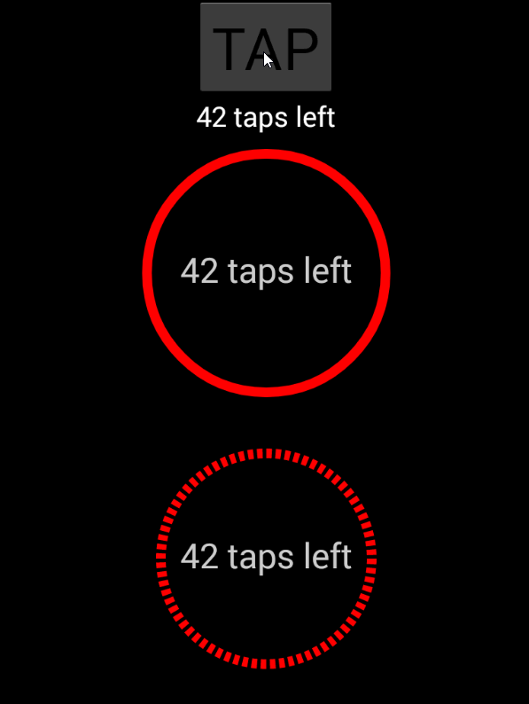

# NativeScript-ProgressBar
A set of XML widget to create native Progress Bars in NativeScript apps.

## Installation
`npm install nativescript-progressbar`

### Screenshot
---------------


## Type of available Progress Bars
* CircleProgressBar
* CircleSegmentBar
* ArcProgressBar
* LineProgressBar

## Usage

### CircleProgressBar

```XML
<page xmlns:pb="nativescript-progressbar">
    <pb:CircleProgressBar
        progress="{{progress}}"
        text="{{message}}"
        textSize="50"
        widthProgressBackground="20"
        widthProgressBarLine="50"
        backgroundColor="red"
        progressColor="blue"
        linearGradient="false"
        width="200"
    />
</page>
```

### CircleSegmentBar

```XML
<page xmlns:pb="nativescript-progressbar">
    <pb:CircleSegmentBar
        progress="{{progress}}"
        text="{{message}}"
        textSize="50"
        widthProgressBackground="20"
        widthProgressBarLine="50"
        backgroundColor="red"
        progressColor="blue"
        linearGradient="false"
        width="200"
    />
</page>
```

### ArcProgressBar

#### Note that ArcProgressBar doesn't have linearGradient property

```XML
<page xmlns:pb="nativescript-progressbar">
    <pb:ArcProgressBar
        progress="{{progress}}"
        text="{{message}}"
        textSize="50"
        widthProgressBackground="20"
        widthProgressBarLine="50"
        backgroundColor="red"
        progressColor="blue"
        width="200"
    />
</page>
```

### LineProgressBar

```XML
<page xmlns:pb="nativescript-progressbar">
    <pb:LineProgressBar
        progress="{{progress}}"
        text="{{message}}"
        textSize="50"
        widthProgressBackground="20"
        widthProgressBarLine="50"
        backgroundColor="red"
        progressColor="blue"
        linearGradient="false"
        width="200"
    />
</page>
```


## Attributes

| Property                | Description                                     | Values       | Notes |
|-------------------------|-------------------------------------------------|--------------|-|
| progress                | Sets the progress value                         | number 0-100 | |
| text                    | Sets the text in the middle of the progress bar | text         | |
| textSize                | Sets the size of the text  color of the button  | number       | |
| widthProgressBackground | Sets the size of the progress background        | number       | |
| widthProgressBarLine    | Sets the size of the progress bar               | number       | |
| backgroundColor         | Sets the color of the progress background       | color        | |
| progressColor           | Sets the color of the progress bar              | color        | |
| linearGradient          | Sets the progress bar color to gradient         | boolean      | Not available for ArcProgressBar |
               

## Android Notes
- We're using [Android-ProgressViewsLib](https://android-arsenal.com/details/1/3186) by [natasam](https://android-arsenal.com/user/natasam)
